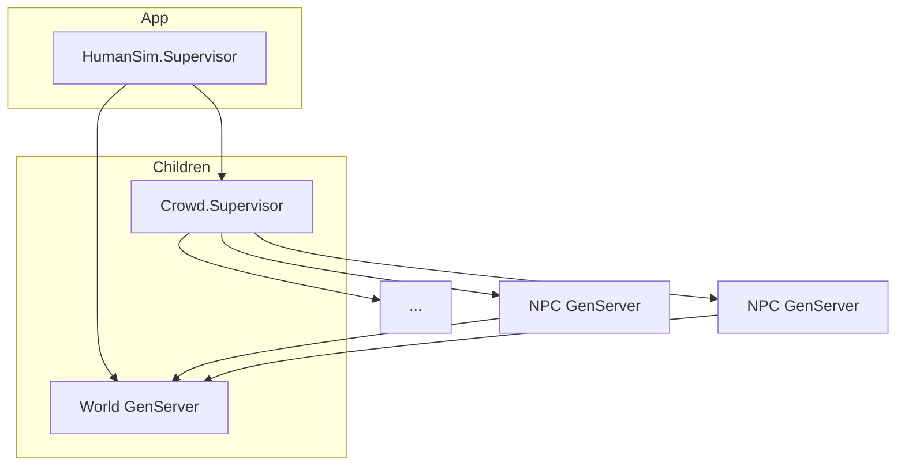

# ARCHITECTURE

## Overview

Human Simulator: many concurrent NPCs (GenServers), a shared World (environment + items), rule-based personalities and dialogue. No ML; all behavior is code-driven.

## Components

| Module | Role |
|--------|------|
| **HumanSim.Application** | Starts Registry (NPC names), World, and Crowd.Supervisor. Strategy: rest_for_one. |
| **World** | GenServer + ETS: areas and items registry. NPCs query/update items and location. |
| **Item** | Struct + behavior: id, type, area_id, state. `Item.interact/2` returns `{effect, updated_item}`. |
| **Personality** | Pure module: trait map (friendly, curious, grumpy, shy, bold). Used by Dialogue and NPC reactions. |
| **Dialogue** | Pure module: topic + personality + mood → response text (templates, weighted rules). |
| **NPC** | GenServer per simulated human: personality, mood, location, memory (last N events). Handles say, hear, chat, use_item, move. |
| **Crowd** | Facade over DynamicSupervisor: spawn_npc/1, spawn_npc_list/2, count/0. |

## Public API summary

| Module | Function | Purpose |
|--------|----------|---------|
| World | `register_area(area_id)` | Register an area. |
| World | `put_item(item)`, `get_item(item_id)`, `list_items_in_area(area_id)` | Item CRUD. |
| World | `interact_item(item_id, actor_id, action \\ :use)` | Run item interaction; returns `{:ok, effect, item}` or `{:error, :not_found}`. |
| Item | `interact(item, action)` | Pure: `action` in `:use`, `:pick_up`, `:inspect`. Returns `{effect_atom, updated_item}`. |
| Personality | `new(traits \\ [])`, `get(personality, key)`, `apply_mood(personality, delta)` | Build and query traits. |
| Dialogue | `respond(topic, personality, mood \\ :neutral)` | Returns response string. Topics: `:greeting`, `:weather`, `:goodbye`, `:general`. |
| NPC | `start_link(opts)` | Opts: `:id`, `:name`, `:personality`, `:area_id`. |
| NPC | `say(npc_id, message)`, `chat(npc_id, topic)`, `hear(npc_id, from_id, message)` | Chat. |
| NPC | `use_item(npc_id, item_id, action)`, `move(npc_id, area_id)`, `get_state(npc_id)` | Environment interaction. |
| Crowd | `spawn_npc(opts)`, `spawn_npc_list(count, base_opts)`, `count()` | Spawn and count NPCs. |

## File map

| Path | Purpose |
|------|---------|
| `human_sim/lib/human_sim/application.ex` | Supervision tree. |
| `human_sim/lib/human_sim.ex` | Top-level module (no public API). |
| `human_sim/lib/human_sim/world.ex` | World GenServer + ETS. |
| `human_sim/lib/human_sim/item.ex` | Item struct + interact/2. |
| `human_sim/lib/human_sim/personality.ex` | Personality struct + new/get/apply_mood. |
| `human_sim/lib/human_sim/dialogue.ex` | respond/3, weighted responses. |
| `human_sim/lib/human_sim/npc.ex` | NPC GenServer; Registry via HumanSim.NPCRegistry. |
| `human_sim/lib/human_sim/crowd.ex` | Crowd facade + DynamicSupervisor usage. |

## Data flow

- **Chat:** Caller uses `NPC.say(npc_id, message)`. NPC infers topic, calls `Dialogue.respond/3`, appends to memory, returns response. For NPC-to-NPC, call `NPC.hear(other_id, from_id, message)` to update the other’s memory.
- **Crowd:** Each NPC is one process under Crowd.Supervisor. Spawn many with `Crowd.spawn_npc_list(n, area_id: :square)`. World does not yet track “who is in area”; add area→[npc_ids] in World if you need proximity.
- **Items:** World stores items in ETS. `World.interact_item(item_id, actor_id, action)` looks up item, calls `Item.interact/2`, writes back updated item, returns `{:ok, effect, updated}`.
- **Personalities:** Stored in NPC state; passed to `Dialogue.respond/3`. Extend reaction logic (e.g. on hear/use_item) by reading personality in NPC handle_*.

## Conventions

- IDs: atoms or binaries for area_id, item_id, npc_id.
- State: immutable structs; GenServers replace state with updated struct.
- ETS: World owns tables; public read for fast lookup.

## Extension points

- **New item types:** Add clauses in `Item.interact/2` for `{type, action, state}`.
- **New dialogue topics:** Add `responses_for(topic, ...)` clause and optionally extend `NPC.infer_topic/1`.
- **Proximity / “who’s here”:** World could maintain area→[npc_id] and NPC could register/unregister on move.
- **NPC–NPC chat:** After one NPC says something, resolve NPCs in same area (from World or a separate registry) and call `NPC.hear/3` on each.

## UI (Phoenix LiveView)

| Module | Role |
|--------|------|
| **HumanSim.Events** | PubSub broadcasts for move, chat, hear. LiveView subscribes. |
| **HumanSim.SimRunner** | Auto-tick GenServer: seeds areas/items/NPCs, drives activity every 2s. |
| **HumanSimWeb.Endpoint** | Phoenix endpoint; serves assets, LiveView socket. |
| **HumanSimWeb.TownSquareLive** | LiveView: 4-area grid, NPC avatars, live feed. |

Run `mix assets.build` then `iex -S mix` or `launch.bat`; open http://localhost:4000.
